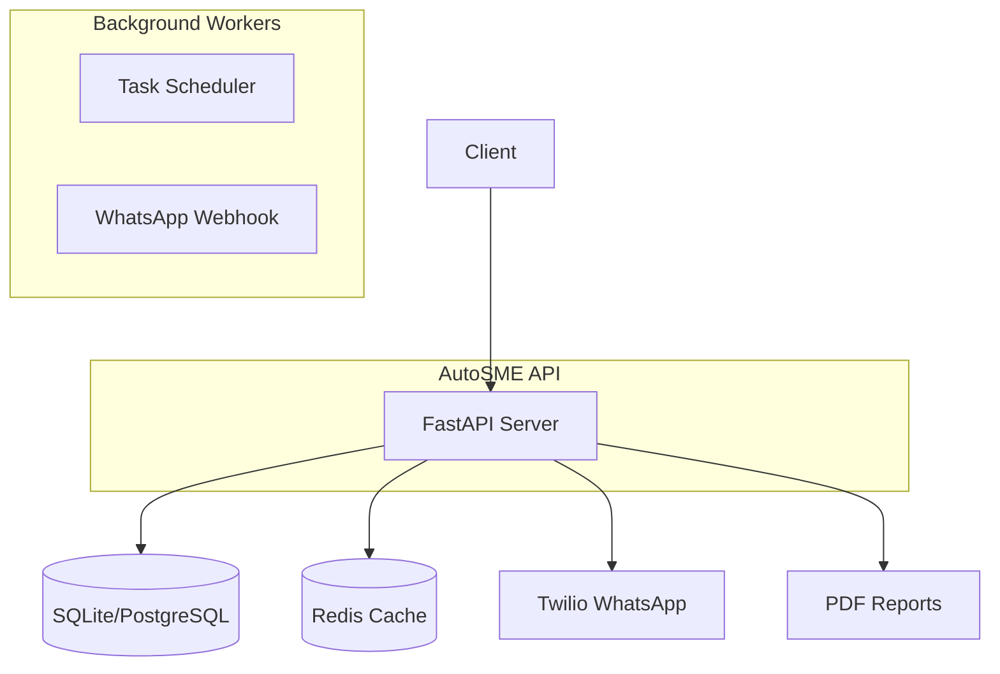

# AutoSME — Production Guide

AI automation for African small businesses. This guide covers deployment, observability, and operations.

## Architecture



**Components:**
- **API** (`src/auto_sme/main.py`): FastAPI server with structured logging, metrics, health checks.
- **Routers**: Tasks, Inventory, Orders, Reports, WhatsApp webhook.
- **Store**: In-memory for MVP; switch to SQLite/PostgreSQL for production.
- **Redis**: Optional for caching and rate limiting (future).

## Quick Start (Production)

```bash
# Clone and install
git clone https://github.com/GBOYEE/auto-sme
cd auto-sme
python -m venv .venv && source .venv/bin/activate
pip install -e .[dev]

# Set environment
export AUTOSME_API_KEY=your-secret-key
export AUTOSME_ENV=production
export DATABASE_URL=sqlite:///data/app.db

# Run
python -m uvicorn src.auto_sme.main:app --host 0.0.0.0 --port 8000
```

## Environment Variables

| Variable | Default | Description |
|----------|---------|-------------|
| `AUTOSME_API_KEY` | `changeme` | API key for protected endpoints |
| `AUTOSME_ENV` | `production` | `development` enables reload |
| `AUTOSME_PORT` | `8000` | Server port |
| `AUTOSME_CORS_ORIGINS` | `*` | Comma-separated allowed origins |
| `DATABASE_URL` | `sqlite:///data/app.db` | Database connection |
| `REDIS_URL` | `redis://redis:6379/0` | Redis connection (optional) |

## Deployment

### Docker Compose (recommended)

```yaml
version: '3.8'
services:
  api:
    build: .
    ports:
      - "8000:8000"
    environment:
      - AUTOSME_API_KEY=${AUTOSME_API_KEY}
      - AUTOSME_ENV=production
      - DATABASE_URL=sqlite:///data/app.db
    volumes:
      - ./data:/app/data
    restart: unless-stopped
    healthcheck:
      test: ["CMD", "curl", "-f", "http://localhost:8000/health"]
      interval: 30s
      timeout: 5s
      retries: 3
```

### Systemd Unit

Create `/etc/systemd/system/auto-sme.service`:

```ini
[Unit]
Description=AutoSME API
After=network.target

[Service]
Type=simple
User=auto-sme
WorkingDirectory=/opt/auto-sme
Environment="AUTOSME_API_KEY=secret"
Environment="AUTOSME_ENV=production"
ExecStart=/opt/auto-sme/.venv/bin/uvicorn src.auto_sme.main:app --host 127.0.0.1 --port 8000
Restart=on-failure

[Install]
WantedBy=multi-user.target
```

Then: `systemctl enable --now auto-sme`

## Observability

### Health & Metrics

- `GET /health` — returns status, version, environment
- `GET /metrics` — returns counters: `requests_total`, `requests_failed`

Example:
```bash
curl http://localhost:8000/health
curl http://localhost:8000/metrics
```

### Logging

Structured JSON logs via Python `logging` module. Set `LOG_LEVEL=INFO` or `DEBUG` via environment.

Each request logs:
```
2026-04-02 23:00:00 INFO auto_sme request completed request_id=abc123 method=GET path=/health status_code=200 duration_ms=12
```

## API Reference

All endpoints require `X-API-Key: your-secret` header except `/webhook/whatsapp`.

| Endpoint | Method | Description |
|----------|--------|-------------|
| `/api/v1/inventory` | POST | Add product |
| `/api/v1/inventory` | GET | List products |
| `/api/v1/inventory/{id}` | PATCH | Adjust stock (`?delta=±N`) |
| `/api/v1/orders` | POST | Create order (deducts stock) |
| `/api/v1/reports/sales` | GET | PDF sales report (`start_date`, `end_date`) |
| `/webhook/whatsapp` | POST | WhatsApp inbound (Twilio webhook) |

See `README.md` for basic usage.

## Testing

```bash
pytest tests/ -v
mypy src/auto_sme
```

## Security

- Use strong `AUTOSME_API_KEY` (min 32 random chars)
- Enforce HTTPS in production (terminate at Nginx)
- Set `AUTOSME_CORS_ORIGINS` to specific domains
- Keep `AUTOSME_ENV=production` in production (disables reloader)
- Regularly rotate API keys and audit logs

## Roadmap

- Persistent storage (PostgreSQL)
- Redis caching and rate limiting
- Multi-tenant support
- Webhook signature verification (Twilio)
- Background job queue (Celery/Arq)
- Admin dashboard (Streamlit)

---

MIT License — see `LICENSE`.
