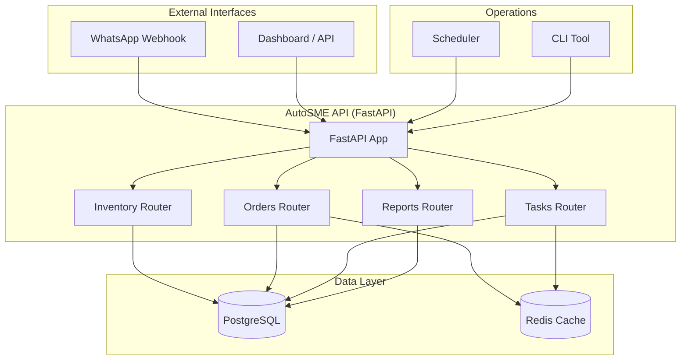

# auto-sme — Deterministic AI Content Pipeline

AI automation for structured content generation with QA validation and PDF output.

[](https://github.com/GBOYEE/auto-sme/actions)
[](https://codecov.io/gh/GBOYEE/auto-sme)
[](LICENSE)

## 🚀 What Problem This Solves

Creating high-quality, structured educational content (or any templated documents) is time-consuming and repetitive. Manual writing leads to inconsistency; generic AI outputs lack formatting and quality control. You need a pipeline that combines AI generation with deterministic templates and PDF output.

## ⚙️ How It Works

auto-sme uses:
- **Jinja2 templates** for deterministic structure
- **LLM integration** (Ollama/OpenRouter) to fill content sections
- **WeasyPrint** to generate polished PDFs with consistent styling
- **QA validation layer** to check page counts, vocabulary, multiple choice counts
- **Asset generation** (SVG diagrams, NGSS alignment, differentiation notes)

You define a template with placeholders; the pipeline calls the LLM for each section, assembles the final document, runs QA, and outputs a print-ready PDF.

## 📈 Why It Matters

- **Speed**: Generate complete units (15+ pages) in hours instead of days
- **Consistency**: Templates ensure every output meets formatting standards
- **Quality**: QA layer catches structural issues before publication
- **Automation**: Fully scripted — run end-to-end with one command
- **Reproducible**: Deterministic workflow means you can regenerate identically

Result: A production content pipeline you can trust for sellable products.

---

## ✨ Features

- **Inventory Management** — add products, adjust stock levels
- **Order Processing** — create orders, automatic stock deduction
- **WhatsApp Integration** — receive orders via Twilio webhook
- **Sales Reports** — generate PDF reports for date ranges
- **Scheduled Tasks** — cron-like automation (future)
- **Observability** — health checks, metrics, structured logging
- **Secure** — API key authentication, CORS controls

---

## 🏗️ Architecture



**Components:**
- **FastAPI** — async REST API with OpenAPI docs at `/docs`
- **PostgreSQL** — persistent storage (products, orders, tasks)
- **Redis** — caching and background job queue
- **Docker Compose** — one-command deployment with health checks

Full architecture guide: [README-PRODUCTION.md](README-PRODUCTION.md#architecture)

---

## 🚀 Quick Start

```bash
# Clone and install
git clone https://github.com/GBOYEE/auto-sme
cd auto-sme
python -m venv .venv && source .venv/bin/activate
pip install -e .[dev]

# Set a strong API key
export AUTOSME_API_KEY=super-secret-key

# Run development server
auto-sme

# Or directly:
uvicorn src.auto_sme.main:app --reload
```

Open API docs: http://localhost:8000/docs

---

## 🔐 Authentication

All endpoints (except `/webhook/whatsapp`) require an API key:

```
X-API-Key: your-secret-key
```

Set via `AUTOSME_API_KEY` environment variable.

---

## 📦 API Endpoints

| Method | Endpoint | Description |
|--------|----------|-------------|
| `POST` | `/api/v1/inventory` | Add product |
| `GET` | `/api/v1/inventory` | List products |
| `PATCH` | `/api/v1/inventory/{id}?delta=N` | Adjust stock (+/-) |
| `POST` | `/api/v1/orders` | Create order (deducts stock) |
| `GET` | `/api/v1/reports/sales?start_date=...&end_date=...` | PDF sales report |
| `POST` | `/webhook/whatsapp` | Twilio WhatsApp webhook (public) |

---

## 🧪 Development

```bash
# Install pre-commit hooks
pre-commit install

# Run tests
pytest tests/ -v

# Type checking
mypy src/auto_sme
```

---

## 📡 Observability

- **Health**: `GET /health` — returns `{status, timestamp, version, environment}`
- **Metrics**: `GET /metrics` — returns `{requests_total, requests_failed}`

---

## 🚢 Deployment

- **Docker Compose** (recommended): `docker-compose up -d`
- **Railway** (one-click): [](https://railway.app/template/auto-sme)
  - Environment variables: `AUTOSME_API_KEY`, `DATABASE_URL` (Railway provides Postgres addon)
- **Systemd**: See `README-PRODUCTION.md` for unit file
- **Nginx**: Reverse proxy to `localhost:8000`

Full deployment guide: [README-PRODUCTION.md](README-PRODUCTION.md)

---

## 🔒 Security

- Change default `AUTOSME_API_KEY` before deploying
- Use HTTPS in production
- Restrict `AUTOSME_CORS_ORIGINS` to your domains
- Keep `AUTOSME_ENV=production` in production

---

## 📄 License

MIT — see [LICENSE](LICENSE).
